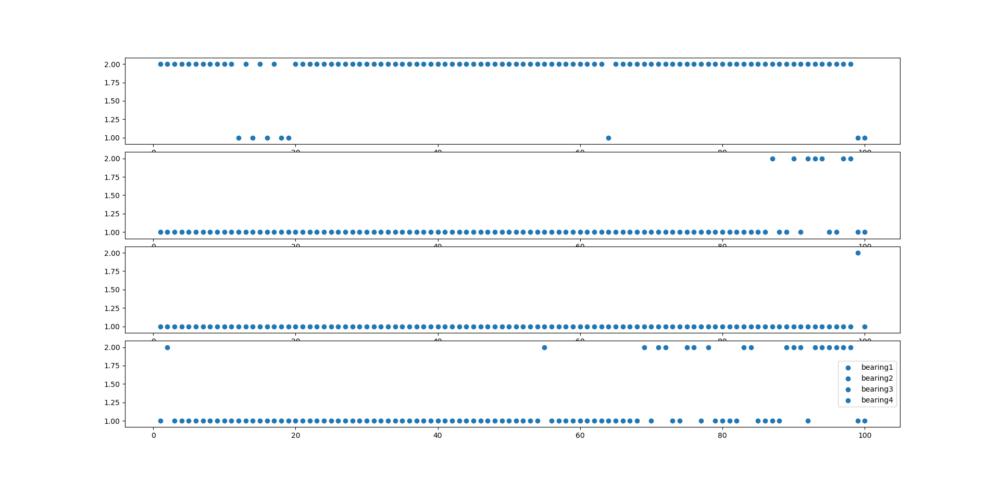
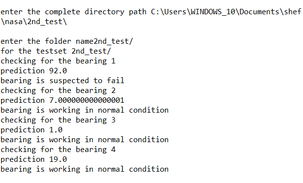

# Real-time time-series anomaly detection

| Gaussian Mixture Model (GMM) | |
| --- | --- |
| Programming Language |  Python |
| Skills (beg, intermediate, advanced) |  Intermediate |
| Time to complete project (in increments of 15 min) |  30 min |
| Hardware needed (hardware used) | Up Squared* board |
| Target Operating System |   |

The monitoring of manufacturing equipment is vital to any industrial process. Sometimes it is critical that equipment be monitored in real-time for faults and anomalies to prevent damage and correlate equipment behavior faults to production line issues. Fault detection is the pre-cursor to predictive maintenance.

There are several methods which don&#39;t require training of a neural network to be able to detect failures, starting with the most basic (FFT), to the most complex (Gaussian Mixture Model).  These have the advantage of being able to be re-used with minor modifications on different data streams, and don&#39;t require a lot of known previously classified data (unlike neural nets). In fact, some of these methods can be used to classify data in order to train DNNs.

## What you&#39;ll learn

- Basic implementation of FFT, Logistic Regression, K-Means clustering, GMM.
- How FFT is helpful in feature engineering of vibrational data of a machine.

## Setup

- Download the Bearing Data Set (also on [https://ti.arc.nasa.gov/tech/dash/groups/pcoe/prognostic-data-repository/](https://ti.arc.nasa.gov/tech/dash/groups/pcoe/prognostic-data-repository/))
- Extract the zip format of data into respective folder named 1st\_test/2nd\_test.
- Make sure you have the following libraries:

  * numpy
  * pandas
  * matplotlib.pyplot
  * sklearn
  * scipy

- Download the code.
- Make sure all the code and data in one folder.

## Gather your materials

- [UP Squared* board](http://www.up-board.org/upsquared/)

## Get the code:

Open the example in a console or any python supported IDE (for example Spyder). Set the working directory where your code and dataset is stored.

## Run the application

 There are multiple files to execute for the Gaussian Mixture Model.

| SAMPLE FILE NAME | EXPECTED OUTPUT | Note |
| --- | --- | --- |
| FreqTime.py | Frequency v/s Time plot |   |
| Train\_GMM.py | Saved weight of the trained module in the filename &quot;GMM&quot; | Training for the GMM is done on testset1, bearing4\_y axis (failed), bearing 2\_x axis (passed) and testset2 bearing1 (failed), bearing2 (passed)\*. The training dataset is increased for a better result. |
| Test\_GMM.py | Result for the particular test set which bearing is failed and the plot of last 100 predicted labels for all the bearings. | Take input path from the user to check which bearing is suspected to fail, and which is in normal condition. The label **0-2 is the range (early-most critical for failure)**. |

## How it works:

**1. FFT:** A fast Fourier transform (FFT) is an algorithm that samples a signal over a period of time (or space) and divides it into its frequency components. These components are single sinusoidal oscillations at distinct frequencies each with their own amplitude and phase.

[Y](https://in.mathworks.com/help/matlab/ref/fft.html#f83-998360-Y) = fft([X](https://in.mathworks.com/help/matlab/ref/fft.html#f83-998360-X)) computes the discrete Fourier transform (DFT) of X using a fast Fourier transform (FFT) algorithm. If X is a vector, then fft(X) returns the Fourier transform of the vector. [**More Details**](https://en.wikipedia.org/wiki/Fast_Fourier_transform)

**2. GMM:** A Gaussian mixture model is a probabilistic model that assumes all the data points are generated from a mixture of a finite number of Gaussian distributions with unknown parameters. One can think of mixture models as generalizing k-means clustering to incorporate information about the covariance structure of the data as well as the centers of the latent Gaussians.

The GaussianMixture object implements the expectation-maximization (EM) algorithm for fitting mixture-of-Gaussian models. It can also draw confidence ellipsoids for multivariate models, and compute the Bayesian Information Criterion to assess the number of clusters in the data. A GaussianMixture.fit method is provided that learns a Gaussian Mixture Model from train data. Given test data, it can assign to each sample the Gaussian it mostly probably belongs to using the GaussianMixture.predict method.

The GaussianMixture comes with different options to constrain the covariance of the difference classes estimated: spherical, diagonal, tied or full covariance. [**More Details**](https://en.wikipedia.org/wiki/Mixture_model)

## Code Explanation:

For all the samples the basic approach is same. Following are the steps that are basic steps:

- Take the fft of each bearing of each file.
- Calculate the Frequency and amplitude of it
- Calculate the top 5 amplitude and their corresponding frequency.
- Repeat the same for each bearing and each data file. Stored the result in the result data frame.

### For FFT : Gives the Frequency vs time plot of each maximum frequency for each dataset.

*Figure 1. Plot for the testset2, max2 frequency for all the bearing.*

### For GMM:

Fit the result data frame into a GMM model, grouping into 3 components (components depicts no of clusters). Save the trained model as GMM using numpy.

For the testing, take input path from the user, to check which bearing is suspected to fail and which is in normal condition. Calculate the no of label 2 for the last 100 predictions if it is greater than 50 then it is suspected to fail. Otherwise, it is in normal condition.

*Figure 2. Predicted last 100 labels for testset2, for all four bearings using the GMM clustering*

*Figure 3. Result of testset2 which bearing has failed using the GMM clustering*
 
**NOTE:**

TESTSET 3 of the NASA bearing dataset is discarded for the observations because of the following reason:

1. It has a 6324 data file in actuality, but according to the documentation it contains a 4448 data file. This makes very noisy data.

2. None of the bearing indicates the symptoms of failure. However, it suddenly fails. This makes data inconsistent.

The above listed reasons describe how testset3 exhibits unpredictable behavior.

